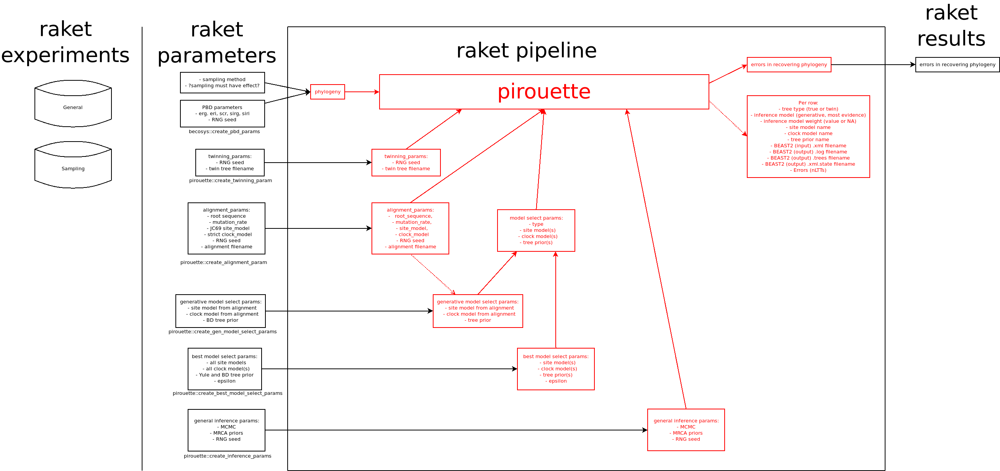

# raket

## Folder structure

In `raket_project`, there are two folders:

 * `data`: the simulated data
 * `results`: the interpreted data, e.g. tables and figures

### The `data` folder

In `data`, all files are put in a folder with a different number
[this deviates from the `razzo` setup, but is easier to program now, 
and can be modified easier in the future].

In each of these folders, the files are:

Filename|Description|Created by
-------------|---------------------------------------|--------------------------
`parameters.RDa`|the parameter file|`create_parameter_files`
`pbd.tree`|the true PBD (species) tree|`create_pbd_tree_file`
`pbd.fasta`|the true PBD alignment|`pirouette`
`bd.tree`|the twin BD tree|`pirouette`
`bd.fasta`|the twin BD alignment|`pirouette`
`pbd.trees`|the posterior trees from `pbd.tree`|`pirouette`
`pbd.log`|the posterior parameter estimates from `pbd.tree`|`pirouette`
`pbd_marg_lik.csv`|the posterior's marginal likelihood from `pbd.tree`|`pirouette`
`bd.trees`|the posterior trees from `bd.tree`|`pirouette`
`bd.log`|the posterior parameter estimates from `bd.tree`|`pirouette`
`bd_marg_lik.csv`|the posterior's marginal likelihood from `bd.tree`|`pirouette`
`pbd_nltts.csv`|the nLTT statistic distribution between `pbd.tree` and `pbd.trees`|`pirouette`
`bd_nltts.csv`|the nLTT statistic distribution between `bd.tree` and `bd.trees`|`pirouette`

See [a raket_werper build log](https://travis-ci.org/richelbilderbeek/raket_project)
to see such a `data` folder.

### The `results` folder

In `results`, there are only files:

Filename|Description|Created by
-------------|---------------------------------------|--------------------------
`esses.csv`|all ESSes|`create_esses_file`
`marg_liks.csv`|all marginal likelihoods|`create_marg_liks_file`
`nltt_stats.csv`|all nLTT statistics, in short form|`create_esses_file`
`figure_1.png`|figure 1|`create_fig_1_file`
`figure_2.png`|figure 2|`create_fig_2_file`

See [a raket_werper build log](https://travis-ci.org/richelbilderbeek/raket_werper)
to see such a `results` folder.

## Function overview

 * Data creation: produces parameter files and output
 * Results creation: creates figures and tables from the data

### Data creation

Produces parameter files and output

#### File handling functions

All functions that end with `_file` or `_files`.
These functions are friendly to scripted use and
require only filenames as arguments.

Status|Description|Function name
---|---|---
?|Create parameter files|`create_parameters_files`
?|Create PBD tree file|`create_pbd_tree_file`

#### Data handling functions

These functions do the actual work. 
They work on parsed data and are not intended to be called from a script

Status|Description|Function name
---|---|---
?|1. Create parameters|`create_parameters`
?|2. Create PBD tree|`create_pbd_tree`

### Results creation

Creates figures and tables from the data.

#### Data handling

All these functions take the project folder's name as an argument
and return a tidy data frame or figure.
They are not intended to be called from a script

Status|Description|Function name
---|---|---
?|Collect marginal likelihoods|`collect_marg_liks`
?|Collect effective sample sizes|`collect_esses`
?|Collect nLTT statistics|`collect_nltt_stats`
?|Create figure 1|`create_fig_1`

#### File handling

All functions that end with `_file` or `_files`.
These functions are friendly to scripted use and
require only the project folder's name as an argument.

Status|Description|Function name
---|---|---
?|Collect marginal likelihoods|`create_marg_liks_file`
?|Collect effective sample sizes|`create_esses_file`
?|Create nLTT statistics file|`create_nltt_stats_file`
?|Create figure 1|`create_fig_1_file`
